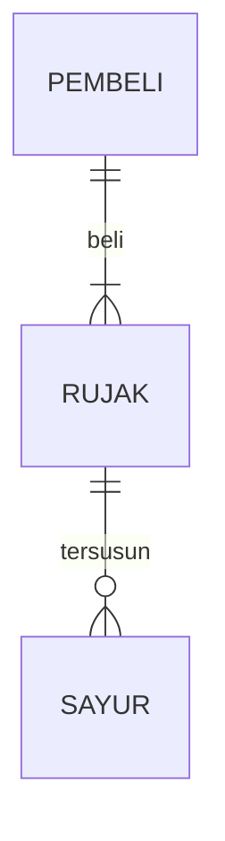

# Job-Interview
## 1.1 Latar Belakang
Latar belakang dari pembuatan aplikasi saya adalah, untuk membantu menghafal alquran khusus nya pada jus 30 karena itu merupakan salah satu kesyaratan lulus dari uin sunan gunung djati, jadi pada awalnya saya mengobrol dengan teman saya mengenai penghafalan alquran,teman saya memberi saran kepada saya untuk penghafalan alquran itu jangan untuk di niatkan di hafal melainkan sering di dengar secara berulang ulang dan saya pun merasa cara itu cukup masuk akal, karena saya pun sering mendengarkan sebuah lagu yang sampai saya hapal semua liriknya, setelah itu muncul lah tugas untuk membuat aplikasi dan saya pun memutuskan untuk membuat aplikasi untuk membantu menghafal alquran tapi setelah dipikir pikir apa bedanya dengan platform yanh sudah ada seperti joox, spotify, dan resso jadi pada akhirnya saya pun memutuskan untuk membuat platform yang kuranh lebih sama dan juga konten nya pun bisa di isi untuk mahasiswa mahasiswa yang ingin berkarya atau pun berdakwah aplikasi ini bisa memwadahi dari karya karya mahasiswa atau artis artis kecil yang ingin meluaskan karya karya mereka

## 1.2. Deksripsi Teknologi Informasi

bla bla bla

## 1.3. Branding

Our Voice
suara kan yang tak tersuarakan

## 2. User Story

bla | bla | bla | bla
---|---|---|---
bla | bla | bla | ⭐⭐⭐⭐⭐

## 3. Struktur Data

Cara membuat aneka macam bentuk grafik menggunakan mermaid.js bisa lihat di [https://mermaid.js.org/syntax/entityRelationshipDiagram.html](https://mermaid.js.org/syntax/entityRelationshipDiagram.html) 

## 4. Arsitektur Sistem

Masih pake mermaid.js juga bisa lihat flowchart di [https://mermaid.js.org/syntax/flowchart.html](https://mermaid.js.org/syntax/flowchart.html)

## 5. Teknologi, Library, dan Framework

bla bla bla

## 6. Desain User Experience dan User Interface

Bisa load image 

## 7. Demonstrasi Video

Link youtube nya

## 8. Bagaimana mesin komputasi dan sistem operasi berperan dalam produk teknologi informasimu ?

Link youtube nya di detik jawaban ini

## 9. Bagaimana algoritma, struktur data, dan bahasa pemrograman berperan dalam produk teknologi informasimu ?

Link youtube nya di detik jawaban ini

## 10. Bagaimana metode pengembangan perangkat lunak / Software Development Life Cycle berperan dalam produk teknologi informasimu ?

Link youtube nya di detik jawaban ini

## 11. Bagaimana database / sistem basis data berperan dalam produk teknologi informasimu ?

Link youtube nya di detik jawaban ini
